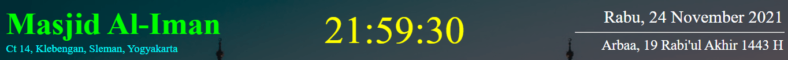
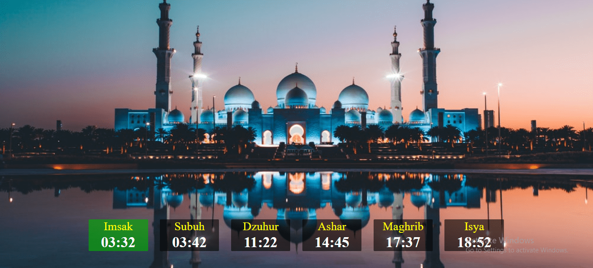
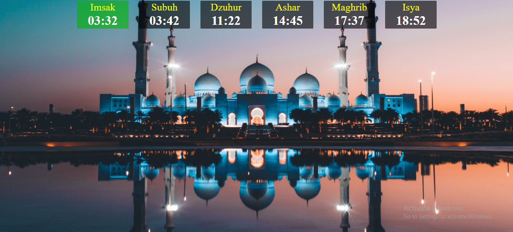
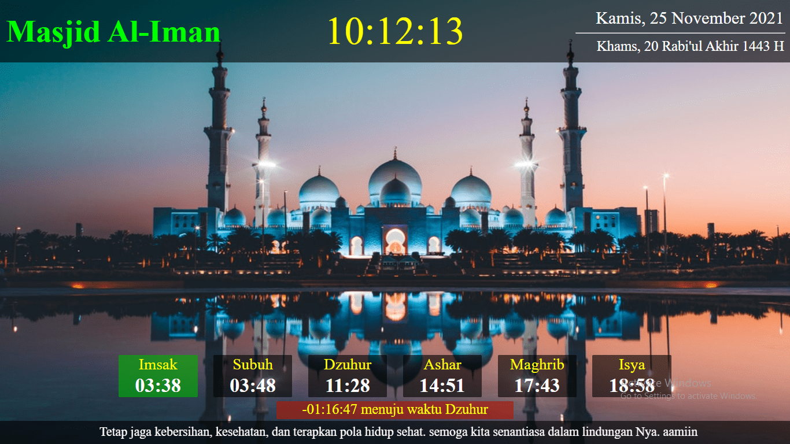

# iMasjid
Informasi Masjid

### Header
- head-type-1

- head-type-2

- head-type-3


### Content
- content-type-1



- content-type-2



- content-type-3


- content-type-4


- #### Pengingat

  
  
### Footer

  

## Preview


## PWA local testing

### Generating app icons from preview.png

You can generate properly sized PNG icons (`img/icon-192.png` and `img/icon-512.png`) from `preview.png` using Node and `sharp`.

Install and run:

```powershell
npm install
npm run generate-icons
```

This will write `img/icon-192.png` and `img/icon-512.png` and update the `manifest.json` to reference them.


Browsers block service workers and manifests when pages are opened via the `file://` protocol. To test PWA features (service worker, manifest, offline caching), serve the project over HTTP.

PowerShell quick options (run from project root):

```powershell
python -m http.server 8080
# or (Node.js):
npx http-server -c-1
```

Open http://localhost:8080, then in DevTools -> Application:
- Check **Manifest** to verify icons and start_url.
- Check **Service Workers** to verify the worker is registered.
- Use **Offline** (Network) to test cached pages.

If you see messages like "Tracking Prevention blocked access to storage", this is a browser privacy feature (Edge/Chrome) blocking third-party storage access. Workarounds:
- Test in a normal browsing profile or relax tracking prevention for localhost.
- Use a browser with relaxed tracking settings for development.

> ## **Semoga bermanfaat bagi kita semua. Aamiin**
